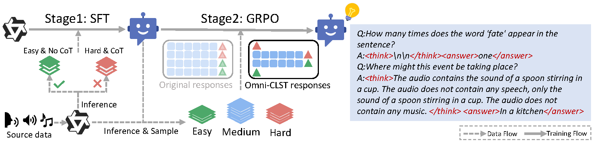

# Omni-CLST: Error-Aware Curriculum Learning with Guided Selective Chain-of-Thought for Audio Question Answering  

  
[](https://huggingface.co/Kiri233/Omni-CLST)  

We propose Omni-CLST, an error-aware Curriculum Learning framework with guided Selective Chain-of-Thought. The framework is built upon Qwen2.5-Omni. Specifically, Omni-CLST first applies a filtering strategy to exploit existing high-quality samples more effectively. To improve GRPO training, samples are then organized into an error-aware curriculum, with a larger proportion of medium and hard examples, enabling the model to focus more on challenging cases while still maintaining a gradual learning progression rather than being randomly subsampled. Finally, inspired by thought dropout, we introduce a guided thought dropout mechanism that selectively removes CoT for cases already solved by the pretrained model, thereby making more effective use of CoT annotations. This design offers a more principled alternative to random dropout. Experiments demonstrate that Omni-CLST achieves a competitive 73.80% on the publicly available MMAU-mini benchmark and establishes a new state of the art with 64.30% on MMAR, validating the effectiveness of error-aware curriculum learning and guided selective CoT.

<div align="center">
  
</div>

## 📀 Installation

1. Clone the repository:

    ```bash
    git clone https://github.com/NKU-HLT/Omni-CLST.git
    cd Omni-CLST
    ```

2. Install the required dependencies:

    ```bash
    conda create -n omniclst python=3.10 -y
    conda activate omniclst
    pip install -r requirements.txt
    ```

## ⭐ Training

1. **Prepare the Dataset**: Download and preprocess the [AVQA](https://mn.cs.tsinghua.edu.cn/avqa/), [Audsemthinker-mc_qa](https://huggingface.co/datasets/gijs/audsem/tree/main) and [our jsonl file](https://huggingface.co/Kiri233/Omni-CLST/tree/main/data).

Put our jsonl file in the `data` folder. The structure should look like this:

    ```
    Omni-CLST
    ├── data
    │   ├── sft_guided_drop_thought
    │   │   ├── train.jsonl
    │   │   ├── valid.jsonl
    │   └── CLST_15k.jsonl
    ```

2. **SFT**: Use the following command to start sft:

    ```bash
    cd script
    bash sft_lora.sh
    ``` 
3. **GRPO**: Use the following command to start grpo:

    ```bash
    cd script
    # will automatically inference the benchmark for the latest checkpoint
    bash CLST.sh 
    ```

## ⭐ Inference

1. **Prepare the Dataset**: Download and preprocess the [MMAU-mini](https://github.com/Sakshi113/mmau) and [MMAR](https://github.com/ddlBoJack/MMAR)

2. **Inference**: Use the following command to start inference:

    ```bash
    cd script
    bash infer.sh "checkpoint_path"
    ```


## 🤝🏻 Contact
Should you have any questions, please contact zhaojinghua_hlt@mail.nankai.edu.cn

## 📚 Citation
Coming soon.

## 🙏 Acknowledgment:
This code is based on the [Ke-Omni-R](https://github.com/shuaijiang/Ke-Omni-R/) repositories. 